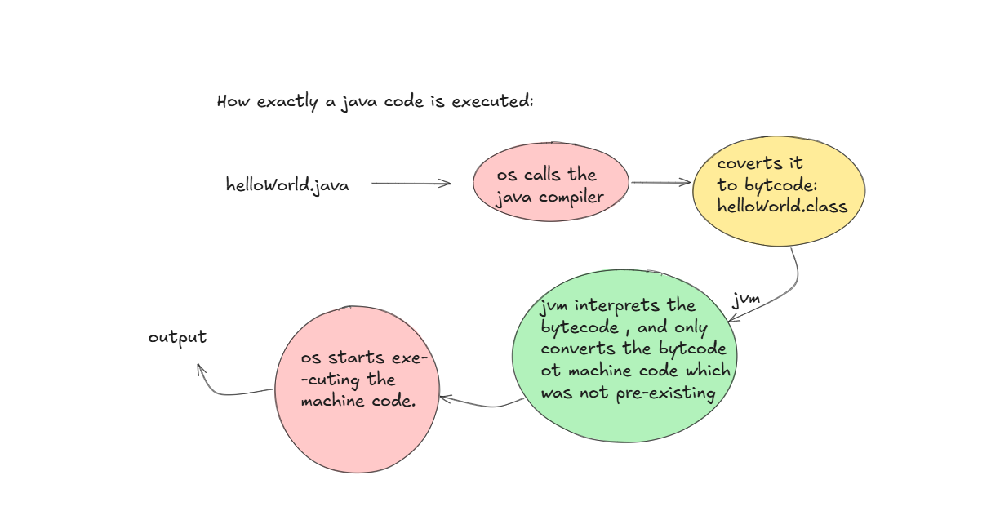

# ☕ How Java Code is Executed

This README explains **how a Java program runs**, step by step, using the diagram below.

---

## 📌 Overview

When you write a Java program, it doesn’t run directly like some other languages. Instead, it goes through multiple stages:

1. **Compilation (Java → Bytecode)**
2. **Execution (Bytecode → Machine Code via JVM)**

---

## 🖼️ Execution Flow Diagram

Below is the diagram illustrating the full process:



---

## 🔄 Step-by-Step Explanation

### 1. 📝 Writing the Code

You start with a `.java` file.

Example:

```java
public class HelloWorld {
    public static void main(StringOperation[] args) {
        System.out.println("Hello, World!");
    }
}
```

---

### 2. ⚙️ Compilation (Java Compiler)

* The **Java Compiler (`javac`)** converts your `.java` file into **bytecode**.
* Output file: `.class`

```bash
javac HelloWorld.java
```

➡️ This generates:

```
HelloWorld.class
```

---

### 3. 📦 Bytecode (Platform Independent)

* Bytecode is **not machine code**.
* It is an intermediate format that can run on any system with a JVM.

---

### 4. 🧠 JVM (Java Virtual Machine)

* The **JVM** reads the bytecode.
* It **interprets** or **compiles it into machine code** (using JIT - Just-In-Time compiler).
* Only required parts are converted during execution.

---

### 5. 💻 Execution by OS

* The converted **machine code** is executed by the OS.
* This produces the final output.

---

### 6. 📤 Output

```
Hello, World!
```

---

## 🔑 Key Concepts

* **Platform Independence** → “Write Once, Run Anywhere”
* **Bytecode** → Intermediate code
* **JVM** → Makes Java portable across systems
* **JIT Compiler** → Improves runtime performance

---

## 🧠 Simple Analogy

* `.java` → Recipe
* Bytecode → Universal instructions
* JVM → Chef
* Machine Code → Cooking process
* Output → Final dish 🍽️

---

## 🚀 Summary

1. Write code → `.java`
2. Compile → `.class`
3. JVM processes bytecode
4. Converts to machine code
5. OS executes → Output

---

# References

1. Java Programming MOOC  
   https://java-programming.mooc.fi/

2. Dev.java Learn  
   https://dev.java/learn/

3. How Java Works Behind the Scenes: A Deep Dive Into Code Execution  
   https://medium.com/@leninm9861/how-java-works-behind-the-scenes-a-deep-dive-into-code-execution-7a6842e38fe3